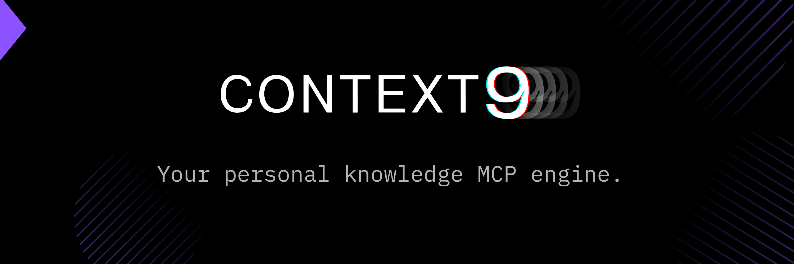
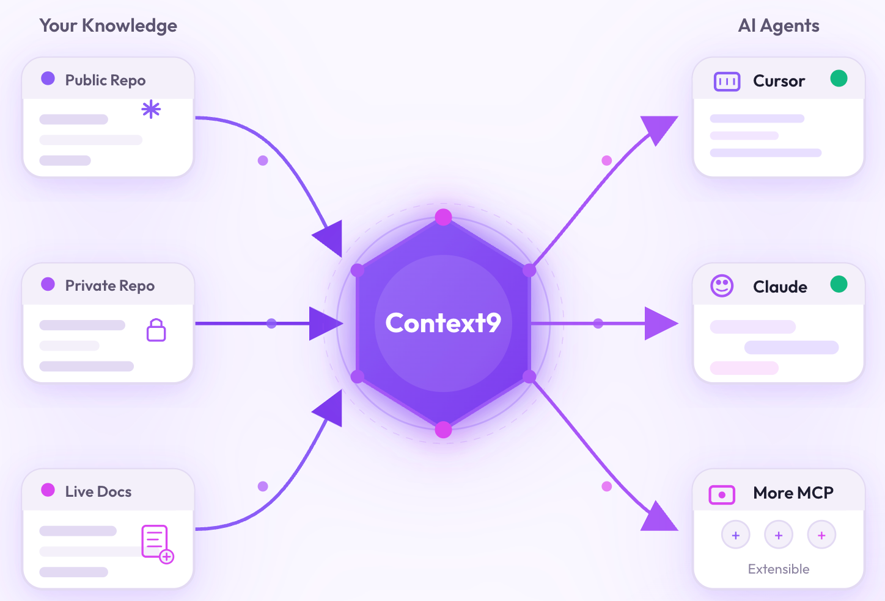
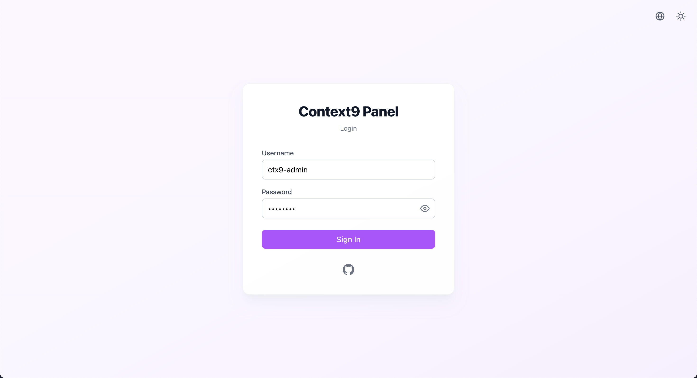
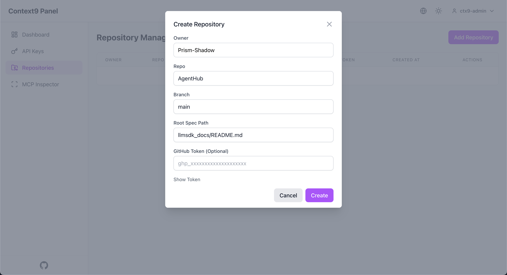
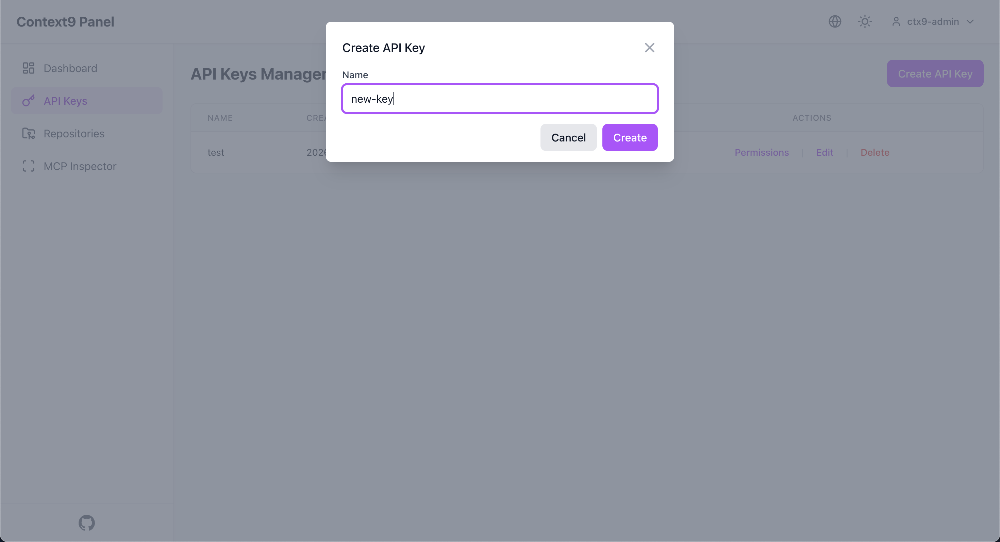
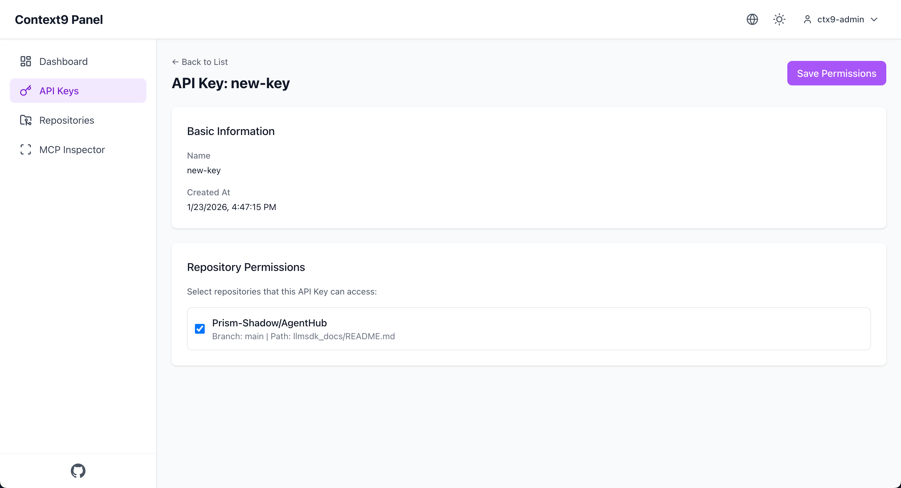
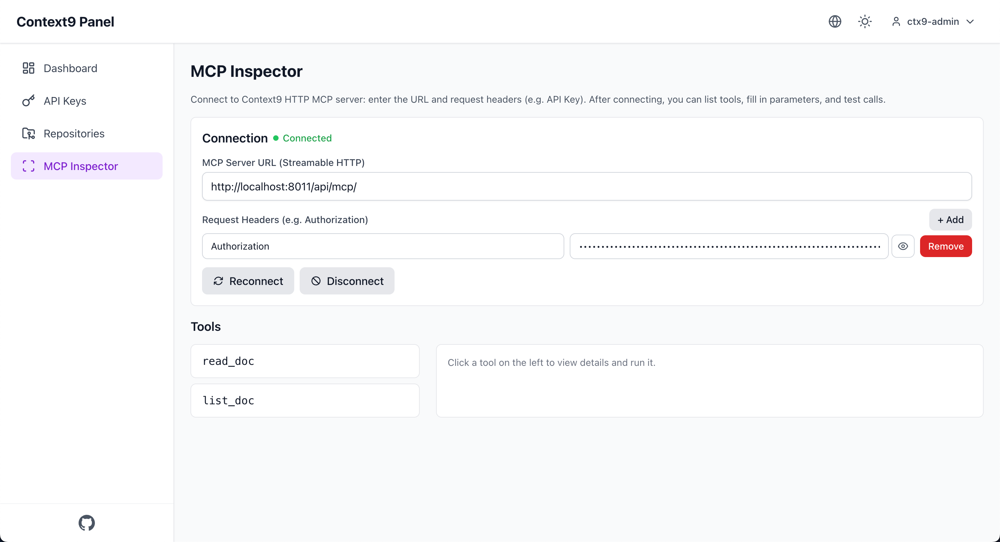

# Context9 — 실시간 문서를 Agent 컨텍스트로

<div align="center">
  <p><b>최신 동기화</b> &middot; <b>로컬 우선</b> &middot; <b>낮은 환각</b></p>
</div>

<div align="center">

**[X](https://x.com/prismshadow_ai)** · **[Discord](https://discord.gg/4TQ2bsSb)** · **[Issues](https://github.com/Prism-Shadow/context9/issues)**

</div>

<div align="center">

[](LICENSE)


</div>

---

https://github.com/user-attachments/assets/553ab8a2-5227-42fa-a8bd-692cd13c0b96

## 왜 Context9 인가?

- 🎯 **최신 문서**: 문서를 실시간으로 동기화하여 AI Agent의 환각을 크게 줄입니다.
- 🔐 **로컬 우선**: 완전 오픈소스이며, 자체 서버에 배포하여 프라이빗 지식을 안전하게 사용할 수 있습니다.
- ⚙️ **사용하기 쉬운 Web UI**: Context9 패널에서 저장소와 API Key 권한을 손쉽게 관리할 수 있습니다.


## Context9는 무엇을 하나요

**Context9(Context Mine)** 는 MCP(Model Context Protocol) 서버입니다. 로컬 환경에 배포하면 최신 문서를 안전하게 Agent에 제공하여 LLM의 환각을 줄여줍니다.

<div style="text-align: center;">
  
</div>


## Context9 설치

### Context9 서버 실행

```shell
docker run -d \
    --name context9 \
    -p 8011:8011 \
    --restart unless-stopped \
    ghcr.io/prism-shadow/context9:latest \
    python -m context9.server --github_sync_interval 600
```

또는 Context9가 사용할 포트를 지정할 수 있습니다.

```shell
docker run -d \
    --name context9 \
    -e CONTEXT9_PORT=<port> \
    -p <port>:<port> \
    --restart unless-stopped \
    ghcr.io/prism-shadow/context9:latest \
    python -m context9.server --github_sync_interval 600
```

## Context9 설정

### Context9 로그인

`http://<server_ip>:8011/` 에 접속하여 Context9에 로그인합니다.

- 기본 사용자 이름: `ctx9-admin`
- 기본 비밀번호: `88888888`

첫 로그인 후 반드시 기본 비밀번호를 변경하세요.




### 저장소 추가

저장소 owner, 저장소 이름, 브랜치를 입력하여 필요한 저장소를 추가합니다.
- 프라이빗 저장소의 경우 [GitHub Token](https://github.com/settings/personal-access-tokens)이 필요합니다.

Context9 템플릿을 사용한 리포지토리 내보내기 및 가져오기
- **리포지토리 내보내기(Export Repos)**: `Export Repos` 버튼을 클릭하면 현재 리포지토리 설정을 로컬 템플릿으로 내보낼 수 있어, 이후에 쉽게 재사용할 수 있습니다.
- **리포지토리 가져오기(Import Repos)**: `Import Repos` 버튼을 클릭하면 Context9 템플릿을 리포지토리 설정으로 가져올 수 있습니다. Context9에서는 참고 및 사용을 위해 여러 개의 [템플릿](./template_repo/)도 제공합니다.




### API Key 추가

Context9에 접근하기 위한 API Key를 생성합니다.



API Key를 생성한 후, 해당 Key가 접근할 수 있는 저장소를 설정하세요.



### Context9 테스트 (선택 사항)

MCP Inspector에 Context9 서버 IP와 API Key를 입력하여 설정을 테스트할 수 있습니다.




## Agent에 Context9 통합

Context9를 배포한 후, 프라이빗 및 퍼블릭 최신 코드 문서를 Agent에 원활하게 통합할 수 있습니다. Cursor, Claude Code 등과 연동할 수 있습니다.

### Cursor에 설치

경로: `Settings` → `Cursor Settings` → `Tools & MCP` → `Add a Custom MCP Server`

아래 설정을 `~/.cursor/mcp.json`에 붙여넣으세요.

프로젝트별로 설정하려면 프로젝트 디렉터리에 `.cursor/mcp.json`을 생성하세요.

```json
{
  "mcpServers": {
    "Context9": {
      "url": "http://<server_ip>:8011/api/mcp/",
      "headers": {
        "Authorization": "Bearer <CTX9_API_KEY>"
      }
    }
  }
}
```


### Claude Code에 설치

아래 명령어를 실행하여 Context9를 Claude Code에 추가합니다.

```shell
claude mcp add --transport http Context9 http://<server_ip>:8011/api/mcp/ --header "Authorization: Bearer <CTX9_API_KEY>"
```


### Context9 사용 권장 사항

매번 Context9 사용을 명시하지 않아도 되도록 다음을 권장합니다.

- Claude Code에서는 `CLAUDE.md` 사용
- Cursor, CodeX 등에서는 `AGENTS.md` 사용
- Cursor에 Rule 추가

#### Claude Code에서 `CLAUDE.md` 사용

`CLAUDE.md`에 아래 내용을 추가하세요.

```
- 항상 Context9를 통해 필요한 문서를 조회한다
```

#### Cursor / CodeX용 `AGENTS.md`

`AGENTS.md`에 다음과 같은 규칙을 추가합니다.

```text
Rules:
- 항상 Context9를 통해 필요한 문서를 조회한다
```

#### Cursor에 Rule 추가

경로: `Setting` → `Rules and Commands` → `Add Rule`

예시:

```text
명시적으로 요청하지 않더라도 항상 Context9 MCP를 사용해 필요한 문서를 가져온다.
```

## Context9로 문서 운영하기

### 엔트리 문서(Spec) 설정

Context9가 저장소 문서를 올바르게 탐색하고 인덱싱할 수 있도록 각 저장소에 Spec 문서를 제공해야 합니다.

기본적으로 저장소 루트에 `spec.md` 파일을 둡니다.

```text
your-repo/
├── spec.md          ← 사양 엔트리 포인트
├── README.md
├── docs/
│   └── ...
└── ...
```

> 파일 이름이나 경로를 변경하는 경우, 저장소 설정도 함께 업데이트하세요.


### 문서에서 상대 경로 링크 사용

MCP, 인덱싱, 문서 해석을 신경 쓸 필요가 없습니다. 일반적인 저장소 상대 경로로 링크를 유지하면 됩니다.

예시:

```markdown
## 관련 문서
- [상세 가이드](docs/detailed-guide.md)
- [API 레퍼런스](guides/api-reference.md)
- [FAQ](faq.md)
```

이 링크들이 저장소 내에서 유효하다면 Context9는 다음을 자동으로 수행합니다.

- 문서 탐색
- 정확한 인덱싱
- AI Agent에 실시간 제공


## 소스 코드로 Context9 배포

<details>
<summary>펼치기</summary>

<h3>GUI 배포</h3>

<p><strong>요구 사항</strong></p>

<ul>
<li>Python >= 3.10</li>
<li>Node.js >= 18</li>
<li>저장소 접근 권한(공개 또는 인증 Token)</li>
</ul>

<h4>Context9 저장소 클론</h4>

<pre><code class="language-shell">git clone https://github.com/Prism-Shadow/context9.git && cd context9
</code></pre>

<h4>Python 환경 설정</h4>

<pre><code class="language-shell">uv sync
uv sync --dev
</code></pre>

<h4>프런트엔드 의존성 설치</h4>

<pre><code class="language-shell">cd gui
npm install
cd ..
</code></pre>

<h4>환경 변수 설정</h4>

<ul>
<li><code>CONTEXT9_PORT</code> (선택): Context9 서비스 포트 (기본값 8011)</li>
</ul>

<pre><code class="language-env">CONTEXT9_PORT=xxxx
</code></pre>

<h4>GUI 빌드 및 서버 실행</h4>

<pre><code class="language-shell">uv run python scripts/start.py --github_sync_interval 600
uv run python scripts/start.py --github_sync_interval 60
</code></pre>

<h3>CLI 배포</h3>

<p><strong>요구 사항</strong></p>

<ul>
<li>Python >= 3.10</li>
<li>저장소 접근 권한</li>
</ul>

</details>


## 라이선스

본 프로젝트는 Apache License 2.0 하에 배포됩니다. 자세한 내용은 [LICENSE](LICENSE)를 참고하세요.

## 감사의 말

이 저장소는 [context7](https://github.com/upstash/context7)의 도움을 받았습니다. 훌륭한 작업과 영감을 제공해 주신 작성자와 기여자분들께 감사드립니다.


## ⭐ Star 히스토리

[](https://www.star-history.com/#Prism-Shadow/context9&type=date&legend=top-left)
